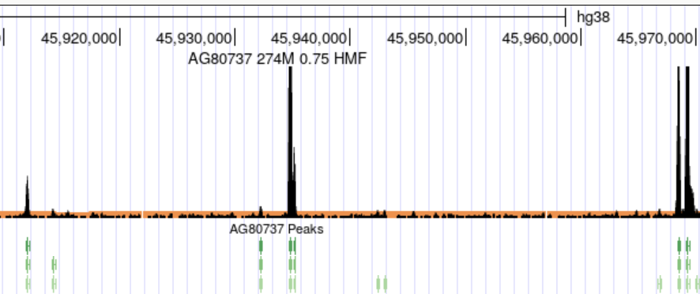

# Calling peaks with hotspot3
hotspot3 identifies regulatory regions with elevated chromatin accessibility or sequencing signal by modeling the background distribution of cut counts.

The method combines:
- **Background modeling** using a negative binomial distribution, fitted within locally uniform genomic segments.  
- **Bayesian segmentation** (via [BABACHI](https://github.com/autosome-ru/BABACHI)) to partition the genome into regions with a homogeneous background (i.e., similar signal-to-noise ratio, modeled using a common overdispersion parameter in the background model).
- **Per-base statistical testing** to assign p-values and estimate FDR for enrichment at each position.  
- **Signal smoothing** using the Maximal Overlap Discrete Wavelet Transform (MODWT) to suppress local noise and normalize fine-scale variability (e.g., transcription factor footprints), enabling more robust peak detection.   
- **Hotspot calling**, which identifies contiguous regions of signal enrichment at a specified FDR threshold.  
- **Peak calling**, which detects local maxima in the smoothed signal and reports those that overlap significant bases.

hotspot3 is designed for high-resolution signal data (e.g., DNase-seq, ATAC-seq) and is optimized for scalability on large datasets with chromosome-level parallelism and optional reuse of intermediate results. 

## Table of contents

- [Command line interface](#command-line-interface)
- [Installation](#installation)
- [Usage example](#usage-example)
- [Input parameters](#input-parameters)
- [Output files](#output-files)
- [Interpreting output](#interpreting-output)
- [Performance and resource requirements](#performance-and-resource-requirements)
- [Authors](#authors)
  
# Command line interface
- `hotspot3` - Call peaks from input data using MODWT-smoothed signal and local background estimation.
- `hotspot3-pvals` - (Experimental) Extract raw p-values for regions defined in a reference BED file. This is useful when comparing or aggregating signal across multiple samples at predefined loci (e.g., shared peak positions), enabling downstream consensus ("core") peak calling.
# Installation
## Prerequisites
`conda` (recommended: `mamba` for faster solves)
`python ≥ 3.8`
## 1. Create conda environment from environment.yml
### For linux:
```mamba env create -n hotspot3 -f environment.yml
conda activate hotspot3
```
### For macOS:
```mamba env create -n hotspot3 -f environment.macos.yml
conda activate hotspot3
```
## 2. Install hotspot3
Once the environment is activated:
```
git clone https://github.com/autosome-ru/hotspot3.git
cd hotspot3
pip install -e .
```
Not on PyPI yet — coming soon!

## 3. Test installation
You can check that the CLI is working with:
```
hotspot3 --help
```
# Usage example 
## Basic peak calling from BAM/CRAM
```
hotspot3 AG10883 \
  --chrom_sizes /net/seq/data2/projects/sabramov/hotspot3/GRCh38_no_alts.nuclear.chrom_sizes \
  --bam AG10883.filtered.cram \
  --fdrs 0.01 0.05 0.1 \
  --outdir ./AG10883 \
  --save_density \
  --cpus 6
```
This performs processing from CRAM, calls peaks at 1%, 5%, and 10% FDR, and saves cutcount density. Uses 6 threads for parallel processing.

## Additional FDR threshold (fast reuse of precomputed data)
```
hotspot3 AG10883 \
  --chrom_sizes /net/seq/data2/projects/sabramov/hotspot3/GRCh38_no_alts.nuclear.chrom_sizes \
  --cutcounts ./AG10883/AG10883.cutcounts.bed.gz \
  --signal_parquet ./AG10883/debug/AG10883.smoothed_signal.parquet \
  --fdrs_parquet ./AG10883/debug/AG10883.fdrs.parquet \
  --fdrs 0.001 \
  --outdir ./AG10883 \
  --cpus 6
```
This reuses previously computed intermediate files to quickly generate peaks at an additional FDR threshold (e.g., 0.001). Runtime is ~30 seconds.

# Input parameters
## Required arguments
- `sample_id` - Unique identifier for the sample (used for naming outputs).
- `--chrom_sizes CHROM_SIZES` - Two-column TSV file with chromosome names and sizes (no header). Local path or URL.
- `--bam BAM` - Path to the input BAM or CRAM file.

- `--fdrs FDRS [FDRS ...]` - Space separated list of FDR thresholds to generate peak calls at. A Parquet track of per-base FDR values is generated only for the largest FDR threshold among provided.

## Arguments to skip steps using pre-calculated data

- `--cutcounts CUTCOUNTS` - Tabix-indexed file with per-base cut counts. Skips extracting cut counts from BAM/CRAM.
- `--signal_parquet SIGNAL_PARQUET` - Path to pre-calculated partitioned parquet file(s) with per-bp smoothed signal. Skips MODWT signal smoothing
- `--pvals_parquet PVALS_PARQUET` - Path to pre-calculated partitioned parquet file(s) with per-bp p-values. Skips p-value calculation
- `--fdrs_parquet FDRS_PARQUET` - Path to pre-calculated fdrs. (Experimental) Can be used with multiple_samples_fdr.py to correct across samples.

## Optional arguments
- `--cpus CPUS` - Number of CPUs to use. High thread count increases memory usage. No benefit from using more threads than chromosomes.
  
- `--reference REFERENCE` - Path to reference FASTA (required for CRAMs missing sequence dictionary).
- `--mappable_bases MAPPABLE_BASES` - Tabix-indexed BED file listing mappable positions.

- `--chromosomes CHROMOSOMES [CHROMOSOMES ...]` - Restrict to specific chromosomes (for debugging).
- `--save_density` -  Save normalized cut count density as output.

- `--debug` - Enable debug mode (extra logging).
- `--outdir OUTDIR` - Path to output directory
- `--tempdir TEMPDIR` - Path to temp directory. Defaults to the system temp location.

## Change if you know what you are doing
- `--window WINDOW` - Smoothing window size for cut counts.
- `--background_window BACKGROUND_WINDOW` - Background window size
- `--signal_quantile SIGNAL_QUANTILE` - Fraction of genomic positions to model as a background (default: 0.995). Used to exclude extreme outliers (e.g., regions with unusually high coverage) when fitting the background model. This reduces computational burden by limiting the background estimation to the lower portion of the signal distribution (e.g., the lowest 99.5% of sites if `--signal_quantile 0.995`).


# Output files
Currently, hotspot3 doesn't delete files in the debug folder upon completion. You can manually delete the created `debug` folder to save disk space.

- Tabix indexed cutcounts: `{sample_id}.cutcounts.bed.gz` (~200MB)
- File with total # of cutcounts: `{sample_id}.total_cutcounts` (~10kb)

- Tabix-indexed BED file summarizing per-segment background model parameters: `{sample_id}.fit_stats.bed.gz` (~20MB)

- Per-bp raw p-values: `{sample_id}.pvals.parquet` (large, ~1.5GB)
- - Normalized cut count density (**cuts per million**) (generated if `--save_density` is specified): `{sample_id}.normalized_density.bw` (~200MB)


For each FDR threshold:
  - tabix indexed hotspots at FDR: `{sample_id}.hotspots.fdr{fdr}.bed.gz`
  - hotspots at FDR in bb (BED12) format
  - tabix indexed peaks at FDR: `{sample_id}.peaks.fdr{fdr}.bed.gz`
  - peaks at FDR in bb (BED12) format

The following files are saved to the debug folder:
    - per-bp smoothed signal: `{sample_id}.smoothed_signal.parquet` (large, ~2GB)
    - estimated parameters background fits: `{sample_id}.fit_params.parquet` (large, ~2GB)
    - per-bp FDR estimates: `{sample_id}.fdrs.parquet` (~600MB)

# Interpreting output
Once hotspot3 has finished running, the most effective way to understand and validate the results is by visualizing key tracks and inspecting background fits.

## Visualizing results in genome browser
You can load the following files in IGV or the UCSC Genome Browser for interactive inspection:


- `{sample_id}.normalized_density.bw` — **(black track)** BigWig file with normalized cut count density (in cuts per million).  
- `{sample_id}.background.bw` — **(orange track)** BigWig file representing the estimated background signal level at each position (defined by raw p-value > 0.005).  
  Overlay with the normalized density to visualize how much observed signal exceeds the modeled background.

- `{sample_id}.hotspots.fdr{fdr}.bb` - called hotspots at each FDR threshold
- `{sample_id}.peaks.fdr{fdr}.bb` - **(green track)** Called peaks at each FDR threshold.


## Flagging problematic segments

The file `{sample_id}.fit_stats.bed.gz` contains background model parameters for each genomic segment identified by `hotspot3`. This file is useful for diagnosing modeling issues that may affect the peak calling.

Each row includes:

- **Coordinates**: `#chr`, `start`, `end`
- **Negative binomial parameters**: `r`, `p`
- **Background and total cut counts**: Total number of tags in the region and how many are assigned to be the background
- **Segment SPOT score**: Signal Proportion Of Tags. Fraction of tags not assigned to background (i.e., signal tags)
- **Overall SPOT score**: Weighted median of segment SPOT scores — a dataset-level quality metric
- **Status flags**: `refit_with_constraint`, `success_fit`, `max_bg_reached`

---

### ⚠️ What to look for

#### `refit_with_constraint = True`
- The segment was initially assigned too much signal (i.e., too high SPOT score).
- It was re-fit using a **minimum background proportion constraint** to prevent overcalling peaks.
- This commonly occurs in regions where the signal distribution deviates from the negative binomial assumption — such as **telomeres**, **centromeres**, or domains with broad accessibility.
- **This is not a failure**, but a safeguard to ensure model robustness.

In these cases, `hotspot3` applies a conservative re-fit to enforce a **maximum signal-to-noise ratio** — by default, **no more than 5×** the global weighted median.  
Outlier segments are identified using a robust linear fit (`RANSACRegressor`) between total signal and estimated background, and re-fit to avoid inflating background estimates.


#### `success_fit = False`
- The model failed to fit a negative binomial distribution for this segment (even when using all the data).
- This happens in regions with very low signal.
- ❗**Peaks will not be called** in these segments.


#### `max_bg_reached = True`
- Even after assigning **99.5% of positions** as background, the remaining 0.5% still contained more signal than allowed.
- This means the segment exceeded the [maximum signal-to-noise ratio threshold](#refit_with_constraint--true) and could not be re-fit under constraints.

This usually indicates:

- ⚠️ **Mapping artifacts** (e.g., multimappers, misalignments)
- ⚠️ **Collapsed repeats or copy number variants**
- ⚠️ **Biological outliers** (e.g., viral integrations)

Segments with this flag **may still produce peaks**, but the background is likely overestimated, which can reduce sensitivity.  
This flag is rare, typically occurring in a small number of samples (e.g., ~100 out of 16,000 analyzed datasets).

---

**Tip:** If many segments are flagged with `max_bg_reached = True`, consider:
- inspecting affected regions visually,
- excluding problematic chromosomes or regions from analysis.
- increasing `--signal_quantile` (e.g., from 0.995 to 0.998)


# Performance and resource requirements
- **Typical runtime**: ~1 hour for a 100 million read CRAM file.
  
- **Runtime is largely independent of dataset coverage**, since most computations are per-base rather than per-read.
  
- **Recommended input coverage**: At least 10 million mapped reads for a somewhat reliable background fit.
  
- **CPU usage**: Parallelized by chromosome. Using more CPUs (e.g., 22 for all chromosomes) reduces wall-clock time but significantly increases memory usage.

- **Memory usage**: ~80 GB RAM with 6 CPUs. Can exceed 150 GB when using 22 threads (e.g., one per chromosome).

- **Recommendation**: Use a machine with 100–200 GB RAM for high-threaded runs (significantly improves time). Reduce thread count to lower memory use.

# Authors

Developed by:

- Sergey Abramov
- Alexandr Boytsov
- Jeff Vierstra

Altius Institute for Biomedical Sciences
